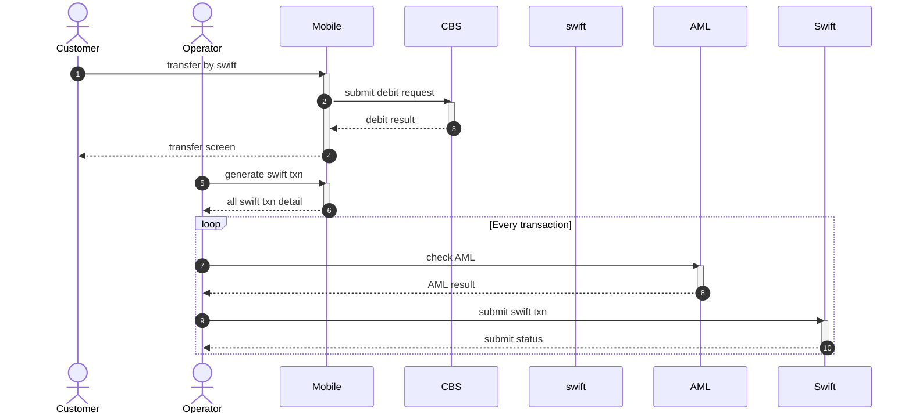
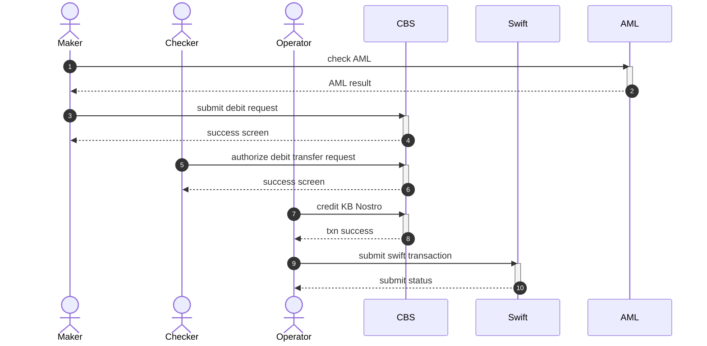
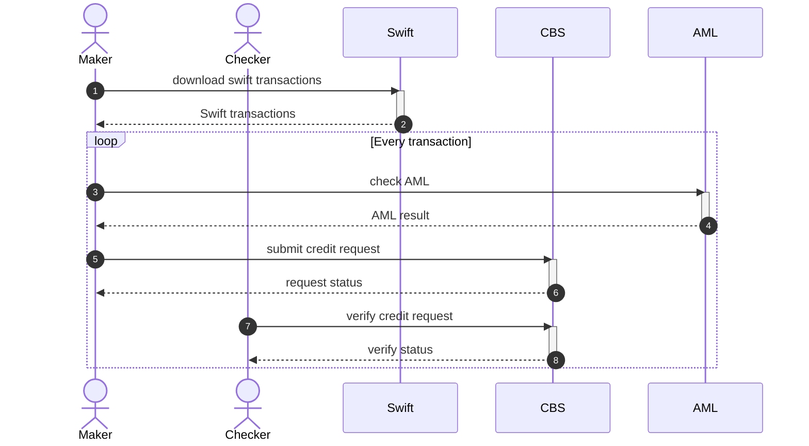
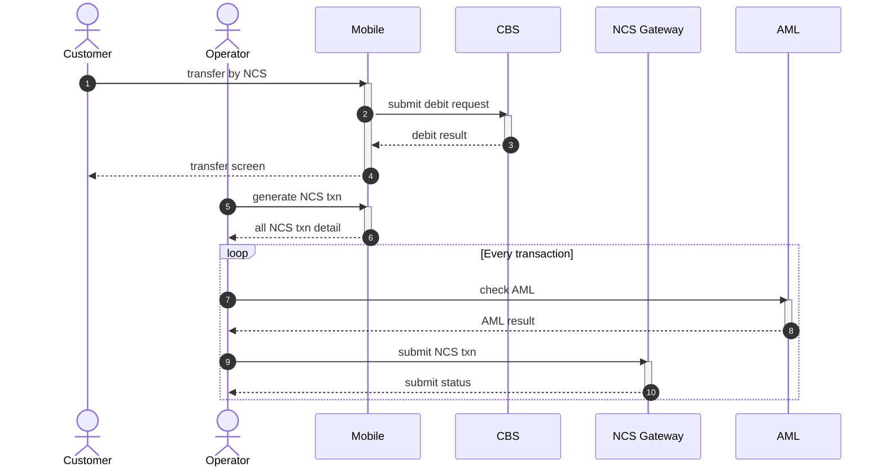
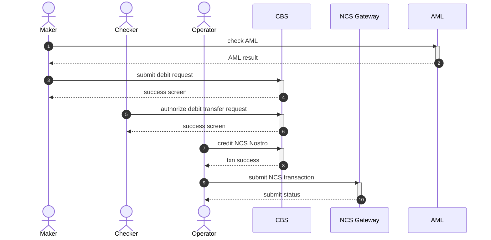
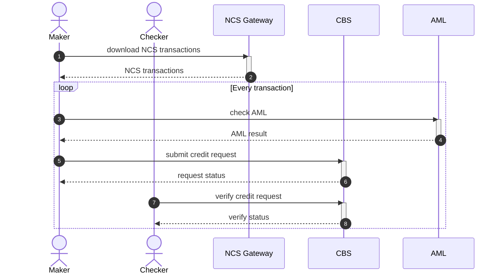

# OTT via MB

```mermaid
sequenceDiagram
    autonumber
    actor Customer
    actor Operator
    participant Mobile
    participant CBS
    participant swift
    participant AML
    Customer->>Mobile: transfer by swift
    activate Mobile
    Mobile->>CBS: submit debit request
    activate CBS
    CBS-->>Mobile: debit result
    deactivate CBS
    Mobile-->>Customer: transfer screen
    deactivate Mobile
    Operator->>Mobile: generate swift txn
    activate Mobile
    Mobile-->>Operator: all swift txn detail
    deactivate Mobile
    loop Every transaction
        Operator->>AML: check AML
        activate AML
        AML-->>Operator: AML result
        deactivate AML
        Operator->>Swift: submit swift txn
        activate Swift
        Swift-->>Operator: submit status
        deactivate Swift
    end
```

# OTT via OTC

```mermaid
sequenceDiagram
    autonumber
    actor Maker
    actor Checker
    actor Operator
    participant CBS
    participant Swift
    participant AML
    Maker->>AML: check AML
    activate AML
    AML-->>Maker: AML result
    deactivate AML
    Maker->>CBS: submit debit request
    activate CBS
    CBS-->>Maker: success screen
    deactivate CBS
    Checker->>CBS: authorize debit transfer request
    activate CBS
    CBS-->>Checker: success screen
    deactivate CBS
    Operator->>CBS: credit KB Nostro
    activate CBS
    CBS-->>Operator: txn success
    deactivate CBS
    Operator->>Swift: submit swift transaction
    activate Swift
    Swift-->>Operator: submit status
    deactivate Swift
```

# ITT via Swift portal

```mermaid
sequenceDiagram
    autonumber
    actor Maker
    actor Checker
    participant Swift
    participant CBS
    participant AML
    Maker->>Swift: download swift transactions
    activate Swift
    Swift-->>Maker: Swift transactions
    deactivate Swift
    loop Every transaction
        Maker->>AML: check AML
        activate AML
        AML-->>Maker: AML result
        deactivate AML
        Maker->>CBS: submit credit request
        activate CBS
        CBS-->>Maker: request status
        deactivate CBS
        Checker->>CBS: verify credit request
        activate CBS
        CBS-->>Checker: verify status
        deactivate CBS
    end
```

# NCS outward via MB

```mermaid
sequenceDiagram
    autonumber
    actor Customer
    actor Operator
    participant Mobile
    participant CBS
    participant NCS Gateway
    participant AML
    Customer->>Mobile: transfer by NCS
    activate Mobile
    Mobile->>CBS: submit debit request
    activate CBS
    CBS-->>Mobile: debit result
    deactivate CBS
    Mobile-->>Customer: transfer screen
    deactivate Mobile
    Operator->>Mobile: generate NCS txn
    activate Mobile
    Mobile-->>Operator: all NCS txn detail
    deactivate Mobile
    loop Every transaction
        Operator->>AML: check AML
        activate AML
        AML-->>Operator: AML result
        deactivate AML
        Operator->>NCS Gateway: submit NCS txn
        activate NCS Gateway
        NCS Gateway-->>Operator: submit status
        deactivate NCS Gateway
    end
```

# NCS outward via OTC

```mermaid
sequenceDiagram
    autonumber
    actor Maker
    actor Checker
    actor Operator
    participant CBS
    participant NCS Gateway
    participant AML
    Maker->>AML: check AML
    activate AML
    AML-->>Maker: AML result
    deactivate AML
    Maker->>CBS: submit debit request
    activate CBS
    CBS-->>Maker: success screen
    deactivate CBS
    Checker->>CBS: authorize debit transfer request
    activate CBS
    CBS-->>Checker: success screen
    deactivate CBS
    Operator->>CBS: credit NCS Nostro
    activate CBS
    CBS-->>Operator: txn success
    deactivate CBS
    Operator->>NCS Gateway: submit NCS transaction
    activate NCS Gateway
    NCS Gateway-->>Operator: submit status
    deactivate NCS Gateway
```

# NCS inward from NCS gateway(API)

```mermaid
sequenceDiagram
    autonumber
    actor Maker
    actor Checker
    participant NCS Gateway
    participant CBS
    participant AML
    Maker->>NCS Gateway: download NCS transactions
    activate NCS Gateway
    NCS Gateway-->>Maker: NCS transactions
    deactivate NCS Gateway
    loop Every transaction
        Maker->>AML: check AML
        activate AML
        AML-->>Maker: AML result
        deactivate AML
        Maker->>CBS: submit credit request
        activate CBS
        CBS-->>Maker: request status
        deactivate CBS
        Checker->>CBS: verify credit request
        activate CBS
        CBS-->>Checker: verify status
        deactivate CBS
    end
```